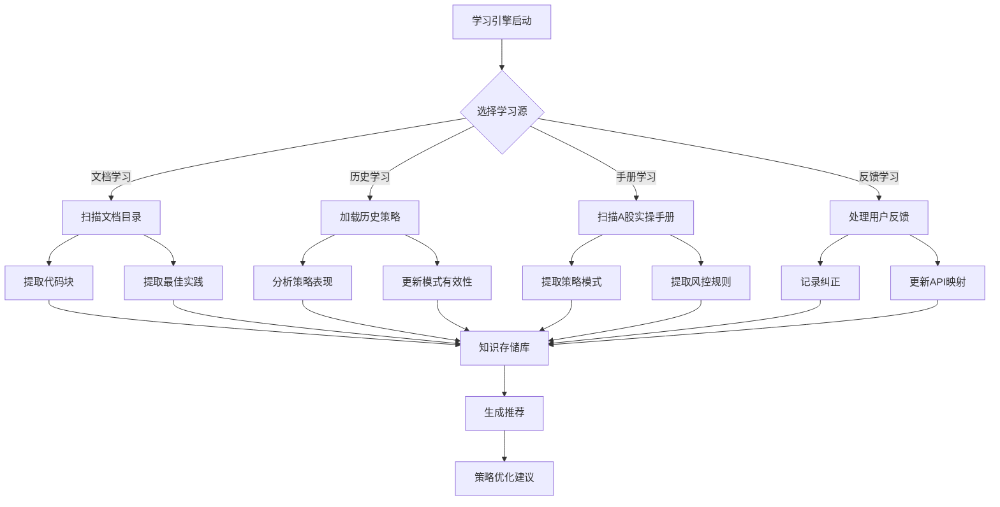

# TRQuant 策略优化器 & 学习引擎 - 完整文档

> **版本**: 1.0.0  
> **更新日期**: 2025-12-03  
> **作者**: TRQuant Team

---

## 📋 目录

1. [概述](#概述)
2. [架构设计](#架构设计)
3. [学习引擎工作流程](#学习引擎工作流程)
4. [核心模块详解](#核心模块详解)
5. [使用指南](#使用指南)
6. [API参考](#api参考)
7. [最佳实践](#最佳实践)

---

## 概述

### 什么是策略优化器？

**策略优化器**是TRQuant扩展的核心模块，提供以下功能：

- 🔍 **代码分析** - 自动解析策略代码，识别核心逻辑、API调用、因子使用
- 🔄 **平台转换** - 一键转换策略代码到不同量化平台（JoinQuant ↔ PTrade ↔ QMT）
- 📊 **报告生成** - 生成完整的策略分析报告（HTML/Markdown）
- 🧠 **智能学习** - 从多个来源持续学习，不断进化优化能力

### 为什么需要学习引擎？

传统量化工具的问题是：
- ❌ 平台API差异大，迁移成本高
- ❌ 最佳实践难以沉淀和复用
- ❌ 知识分散，无法系统化积累
- ❌ 策略模式无法自动识别和推荐

**学习引擎**解决了这些问题：
- ✅ 自动从文档、历史策略、用户反馈中学习
- ✅ 知识库持续积累和进化
- ✅ 智能推荐缺失的模式和最佳实践
- ✅ 实时同步A股实操手册更新

---

## 架构设计

### 整体架构图

```
┌─────────────────────────────────────────────────────────────┐
│                  TRQuant 策略优化器                          │
├─────────────────────────────────────────────────────────────┤
│                                                              │
│  ┌──────────────┐  ┌──────────────┐  ┌──────────────┐     │
│  │  代码分析器  │  │  平台适配器  │  │  报告生成器  │     │
│  │ CodeAnalyzer│  │PlatformAdapter│ │ReportGenerator│     │
│  └──────────────┘  └──────────────┘  └──────────────┘     │
│         │                  │                  │             │
│         └──────────────────┼──────────────────┘             │
│                            │                                │
│                    ┌───────▼────────┐                       │
│                    │ 学习引擎核心   │                       │
│                    │ Learning Core  │                       │
│                    └───────┬────────┘                       │
│                            │                                │
│         ┌──────────────────┼──────────────────┐            │
│         │                  │                  │             │
│  ┌──────▼──────┐  ┌───────▼──────┐  ┌───────▼──────┐     │
│  │ 文档学习器  │  │ 历史学习器    │  │ 手册学习器   │     │
│  │Document     │  │History       │  │Manual        │     │
│  │Learner      │  │Learner       │  │Learner       │     │
│  └──────┬──────┘  └───────┬──────┘  └───────┬──────┘     │
│         │                  │                  │             │
│         └──────────────────┼──────────────────┘             │
│                            │                                │
│                    ┌───────▼────────┐                       │
│                    │  知识存储库    │                       │
│                    │ KnowledgeStore │                       │
│                    │                │                       │
│                    │ [策略模式]     │                       │
│                    │ [最佳实践]     │                       │
│                    │ [API映射]      │                       │
│                    │ [用户反馈]     │                       │
│                    └────────────────┘                       │
│                                                              │
└─────────────────────────────────────────────────────────────┘
```

### 模块依赖关系

```
StrategyOptimizerService (主服务)
    ├── CodeAnalyzer (代码分析)
    ├── PlatformAdapter (平台转换)
    ├── ReportGenerator (报告生成)
    └── Learning Engine (学习引擎)
        ├── StrategyLearner (策略学习器)
        │   ├── DocumentLearner (文档学习)
        │   ├── HistoryLearner (历史学习)
        │   └── FeedbackLearner (反馈学习)
        ├── ManualLearner (手册学习器)
        └── KnowledgeStore (知识存储)
```

---

## 学习引擎工作流程

### 1. 完整学习流程



### 2. 文档学习流程

```
┌─────────────────────────────────────────────────────────┐
│              文档学习流程 (Document Learning)            │
└─────────────────────────────────────────────────────────┘

输入: 文档路径列表
  ↓
[步骤1] 扫描文档文件
  ├── Markdown文件 (.md)
  ├── Python文件 (.py)
  └── 文本文件 (.txt)
  ↓
[步骤2] 内容解析
  ├── 提取代码块 (```python ... ```)
  ├── 提取函数定义 (def function_name)
  ├── 提取最佳实践标记 (建议、注意、提示)
  └── 提取风控规则 (止损、止盈、仓位)
  ↓
[步骤3] 模式识别
  ├── 选股模式 (select/filter/stock相关)
  ├── 择时模式 (timing/signal/trend相关)
  ├── 风控模式 (stop/risk/position相关)
  └── 执行模式 (order/trade/execute相关)
  ↓
[步骤4] 知识提取
  ├── 创建策略模式 (StrategyPattern)
  ├── 创建最佳实践 (BestPractice)
  └── 更新知识库 (KnowledgeStore)
  ↓
输出: 学习统计 (patterns, practices, learned)
```

### 3. 历史学习流程

```
┌─────────────────────────────────────────────────────────┐
│           历史学习流程 (History Learning)                 │
└─────────────────────────────────────────────────────────┘

输入: 历史策略列表 [{code, filename, performance}]
  ↓
[步骤1] 策略分析
  ├── 代码分析 (CodeAnalyzer)
  ├── 提取组件 (选股/择时/风控/执行)
  └── 识别因子和指标
  ↓
[步骤2] 表现评估
  ├── 成功策略 (returns > 10%, sharpe > 1.0, drawdown < -20%)
  └── 失败策略 (returns < -10%)
  ↓
[步骤3] 模式有效性更新
  ├── 成功策略 → 模式有效性 +5
  ├── 失败策略 → 模式有效性 -3
  └── 有风控策略 → 风控模式有效性 +2
  ↓
[步骤4] 经验总结
  ├── 记录成功模式组合
  ├── 记录失败原因
  └── 更新最佳实践
  ↓
输出: 分析统计 (analyzed, successPatterns, failurePatterns)
```

### 4. 手册学习流程（实时更新）

```
┌─────────────────────────────────────────────────────────┐
│        手册学习流程 (Manual Learning + Watch)           │
└─────────────────────────────────────────────────────────┘

初始化:
  ├── 扫描 AShare-manual/src/pages/
  ├── 识别书籍目录 (ashare-book1~5, ashare)
  └── 建立章节映射
  ↓
[阶段1] 批量学习
  ├── 遍历所有 .md 文件
  ├── 提取代码块和知识
  └── 分类存储到知识库
  ↓
[阶段2] 实时监听
  ├── 监听文件系统变化 (fs.watch)
  ├── 检测 .md 文件更新
  └── 自动重新学习变更文件
  ↓
[阶段3] 增量更新
  ├── 提取新内容
  ├── 更新知识库
  └── 通知用户更新完成
  ↓
输出: 实时同步的知识库
```

### 5. 反馈学习流程

```
┌─────────────────────────────────────────────────────────┐
│           反馈学习流程 (Feedback Learning)                │
└─────────────────────────────────────────────────────────┘

输入: 用户反馈
  ├── correction (纠正) - API转换错误
  ├── improvement (改进) - 优化建议
  ├── bug (问题) - 功能缺陷
  └── feature (功能) - 新需求
  ↓
[步骤1] 反馈分类
  ├── 纠正 → 学习API映射
  ├── 改进 → 创建最佳实践
  ├── 问题 → 记录待修复
  └── 功能 → 记录需求
  ↓
[步骤2] 知识提取
  ├── 从纠正中提取新的API映射规则
  ├── 从改进中提取最佳实践
  └── 更新知识库
  ↓
[步骤3] 反馈处理
  ├── 标记为已处理
  └── 保存到知识库
  ↓
输出: 改进的知识库
```

### 6. 智能推荐流程

```
┌─────────────────────────────────────────────────────────┐
│           智能推荐流程 (Intelligent Recommendation)      │
└─────────────────────────────────────────────────────────┘

输入: 策略代码
  ↓
[步骤1] 代码分析
  ├── 分析代码结构
  ├── 识别已有组件
  └── 检测缺失功能
  ↓
[步骤2] 知识匹配
  ├── 查询知识库中的模式
  ├── 查询最佳实践
  └── 匹配相关API映射
  ↓
[步骤3] 推荐生成
  ├── 如果缺少风控 → 推荐风控模式
  ├── 如果选股简单 → 推荐复杂选股模式
  ├── 如果缺少止损 → 推荐止损最佳实践
  └── 如果缺少日志 → 推荐日志最佳实践
  ↓
[步骤4] 排序和过滤
  ├── 按有效性排序
  ├── 去重
  └── 返回TOP推荐
  ↓
输出: 推荐列表 (patterns, practices)
```

---

## 核心模块详解

### 1. KnowledgeStore (知识存储库)

**职责**: 持久化存储所有学习到的知识

**数据结构**:
```typescript
interface LearningData {
    patterns: StrategyPattern[];      // 策略模式
    apiMappings: APIMapping[];        // API映射规则
    bestPractices: BestPractice[];    // 最佳实践
    userFeedback: UserFeedback[];     // 用户反馈
}
```

**存储位置**: `{storagePath}/knowledge.json`

**内置知识**:
- 6个策略模式（多因子选股、动量择时、固定止损等）
- 7个最佳实践（必须设置止损、控制单票仓位等）

### 2. StrategyLearner (策略学习器)

**职责**: 从文档、历史、反馈中学习

**主要方法**:
- `learnFromDocuments()` - 从文档学习
- `learnFromHistory()` - 从历史策略学习
- `recordFeedback()` - 记录用户反馈
- `recommendPatterns()` - 推荐模式
- `recommendBestPractices()` - 推荐最佳实践

### 3. ManualLearner (手册学习器)

**职责**: 从A股实操手册实时学习

**主要方法**:
- `learnFromManual()` - 批量学习整个手册
- `watchForUpdates()` - 监听文件更新
- `getChapterKnowledge()` - 获取特定章节知识

**支持的书籍**:
- `ashare-book1` - A股投资基础 (10章)
- `ashare-book2` - 宏观经济 (11章)
- `ashare-book3` - 个股研究 (11章)
- `ashare-book4` - 技术分析 (5章)
- `ashare-book5` - 量化专题 (11章)
- `ashare` - A股量化核心 (8章)

### 4. CodeAnalyzer (代码分析器)

**职责**: 分析策略代码结构

**分析内容**:
- 元信息（名称、描述、回测区间）
- 代码块（函数、类、变量）
- 组件分类（选股/择时/风控/执行）
- API使用情况
- 因子和指标使用
- 平台兼容性

### 5. PlatformAdapter (平台适配器)

**职责**: 在不同平台间转换代码

**支持的转换**:
- JoinQuant → PTrade
- PTrade → JoinQuant
- JoinQuant → QMT (规划中)

**转换内容**:
- API调用替换
- 参数映射
- 代码结构调整
- 股票代码格式转换

### 6. ReportGenerator (报告生成器)

**职责**: 生成策略分析报告

**报告格式**:
- HTML (可视化，带图表)
- Markdown (纯文本)
- JSON (结构化数据)

**报告内容**:
- 投资理念
- 代码架构
- 平台兼容性
- 优化建议
- 代码质量评估

---

## 使用指南

### 基本使用

#### 1. 分析策略代码

```typescript
import { strategyOptimizer } from './services/strategyOptimizer';

const code = `...策略代码...`;
const analysis = strategyOptimizer.analyzeStrategy(code, 'my_strategy.py');
```

#### 2. 转换到目标平台

```typescript
const result = strategyOptimizer.convertToPlatform(code, 'ptrade');
if (result.success) {
    console.log('转换后的代码:', result.convertedCode);
}
```

#### 3. 生成报告

```typescript
const report = strategyOptimizer.generateReport(code, 'html');
// 保存为HTML文件
```

### 学习引擎使用

#### 1. 初始化学习引擎

```typescript
const storagePath = context.globalStorageUri.fsPath;
const manualPath = path.join(context.extensionPath, 'AShare-manual');

strategyOptimizer.initLearner(storagePath, manualPath);
```

#### 2. 从手册学习

```typescript
const result = await strategyOptimizer.learnFromManual();
console.log(`学习了 ${result.stats.patternsExtracted} 个模式`);
```

#### 3. 监听手册更新

```typescript
const watcher = strategyOptimizer.watchManualUpdates((filename) => {
    console.log(`手册更新: ${filename}`);
});
```

#### 4. 获取推荐

```typescript
const patterns = strategyOptimizer.getRecommendedPatterns(code);
const practices = strategyOptimizer.getRecommendedPractices(code);
```

### VS Code命令

| 命令 | 说明 |
|------|------|
| `TRQuant: 策略优化器` | 打开优化器面板 |
| `TRQuant: 转换为PTrade格式` | 快速转换当前文件 |
| `TRQuant: 生成策略报告` | 生成分析报告 |
| `TRQuant: 从实操手册学习` | 从A股实操手册学习 |
| `TRQuant: 知识库统计` | 查看知识库统计 |

---

## API参考

### StrategyOptimizerService

#### 方法

##### `analyzeStrategy(code: string, filename?: string): StrategyAnalysis`
分析策略代码

##### `convertToPlatform(code: string, targetPlatform: Platform, analysis?: StrategyAnalysis): ConversionResult`
转换到目标平台

##### `generateReport(code: string, format: 'json' | 'markdown' | 'html'): StrategyReport | string`
生成策略报告

##### `initLearner(storagePath: string, manualPath?: string): void`
初始化学习引擎

##### `learnFromManual(): Promise<{success, stats, log}>`
从A股实操手册学习

##### `getRecommendedPatterns(code: string): StrategyPattern[]`
获取推荐模式

##### `getRecommendedPractices(code: string): BestPractice[]`
获取推荐最佳实践

##### `getLearningStats(): Stats | null`
获取学习统计

### StrategyLearner

#### 方法

##### `learnFromDocuments(docPaths: string[]): Promise<Result>`
从文档学习

##### `learnFromHistory(strategies: Strategy[]): Promise<Result>`
从历史策略学习

##### `recordFeedback(feedback: Feedback): void`
记录用户反馈

##### `processFeedback(): Promise<Result>`
处理反馈并学习

### ManualLearner

#### 方法

##### `learnFromManual(): Promise<Result>`
扫描并学习整个手册

##### `watchForUpdates(callback?: Function): FSWatcher`
监听手册更新

##### `getChapterKnowledge(bookDir: string, chapterNum: string): Knowledge`
获取特定章节知识

---

## 最佳实践

### 1. 知识库管理

- ✅ **定期学习**: 每次手册更新后执行学习
- ✅ **版本控制**: 知识库文件建议加入版本控制
- ✅ **备份**: 定期备份知识库文件

### 2. 学习策略

- ✅ **增量学习**: 优先使用实时监听，避免全量扫描
- ✅ **分类学习**: 按书籍/章节分类学习，便于管理
- ✅ **质量控制**: 定期审查学习结果，确保质量

### 3. 推荐使用

- ✅ **上下文相关**: 根据代码分析结果推荐相关模式
- ✅ **优先级排序**: 按有效性和相关性排序推荐
- ✅ **用户反馈**: 收集用户对推荐的使用反馈

### 4. 性能优化

- ✅ **异步处理**: 学习过程使用异步，避免阻塞
- ✅ **缓存机制**: 缓存分析结果，避免重复计算
- ✅ **批量处理**: 批量学习时使用批处理优化

---

## 数据流图

### 完整数据流

```
用户操作
  ↓
策略代码输入
  ↓
┌─────────────────┐
│  代码分析器     │ → 提取结构、API、因子
└────────┬────────┘
         ↓
┌─────────────────┐
│  学习引擎       │ → 查询知识库、生成推荐
└────────┬────────┘
         ↓
┌─────────────────┐
│  平台适配器     │ → 转换代码
└────────┬────────┘
         ↓
┌─────────────────┐
│  报告生成器     │ → 生成报告
└────────┬────────┘
         ↓
输出结果（转换代码、报告、推荐）
```

### 学习数据流

```
学习源
  ├── A股实操手册 → ManualLearner → KnowledgeStore
  ├── 文档文件 → StrategyLearner → KnowledgeStore
  ├── 历史策略 → StrategyLearner → KnowledgeStore
  └── 用户反馈 → StrategyLearner → KnowledgeStore
         ↓
    KnowledgeStore
         ↓
    知识查询
         ↓
    智能推荐
         ↓
    策略优化
```

---

## 扩展开发

### 添加新的学习源

1. 创建新的学习器类
2. 实现 `learn()` 方法
3. 集成到 `StrategyOptimizerService`
4. 添加到学习流程

### 添加新的推荐规则

1. 在 `StrategyLearner.recommendPatterns()` 中添加规则
2. 更新知识库查询逻辑
3. 测试推荐效果

### 自定义知识存储

1. 扩展 `KnowledgeStore` 类
2. 添加新的数据结构
3. 实现持久化逻辑

---

## 故障排查

### 常见问题

**Q: 学习失败，提示"手册路径不存在"**
- A: 检查 `AShare-manual` 目录是否存在，路径是否正确

**Q: 知识库统计为0**
- A: 执行 `TRQuant: 从实操手册学习` 命令初始化知识库

**Q: 推荐结果为空**
- A: 确保知识库已学习，检查代码分析是否正确

**Q: 文件监听不工作**
- A: 检查文件系统权限，确保有读取权限

---

## 更新日志

### v1.0.0 (2025-12-03)
- ✅ 初始版本发布
- ✅ 实现代码分析器
- ✅ 实现平台适配器
- ✅ 实现报告生成器
- ✅ 实现学习引擎
- ✅ 实现手册学习器
- ✅ 支持实时更新监听

---

## 参考资料

- [策略优化器源码](../src/services/strategyOptimizer/)
- [A股实操手册](../../AShare-manual/)
- [类型定义](../src/services/strategyOptimizer/types.ts)

---

**文档维护**: TRQuant Team  
**最后更新**: 2025-12-03

